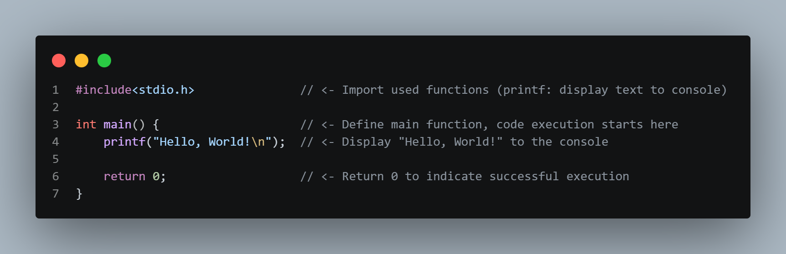

# Hello, World!

**This is the "Hello, World!" example—the starting point for every programming language—which will help you see the syntax of the C language.**

you can check example code from [here](../code/01_01_hello_world.c)

[Go to quiz](../quiz/01_quiz.c)

Back
[Next](../../02_data_types/./documents/02_01_data_types.md)