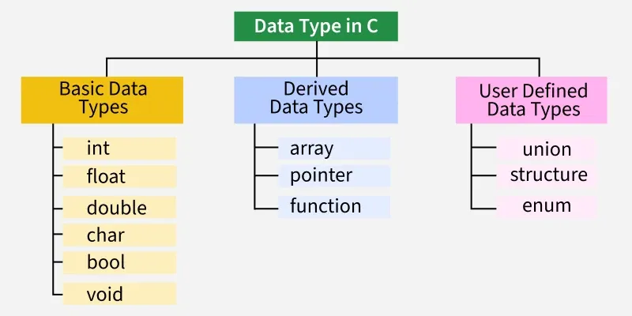

# Data Types in C

**C language is type-strict language. Every variable in C must be associated with a data type**

**Data types in C are broadly classified into three categories:**

- Basic Data Types
  - **int**: whole number (positive, negative, or zero)
  - **float**: decimal numbers with 6 decimal digits
  - **double**: decimal numbers with 12 decimal digits (more precise)
  - **char**: stores a single character
  - **bool**: stores True or False value
  - **void**: no value or empty type, mostly `used in functions that do not return any value.
- Derived Data Types
  - **array**: stores multiple values of the same data type in contiguous memory locations. Each element is accessed using an index, starting from 0.
  - **pointer**: stores the memory address of another variable
  - **function**: a block of code that perform a specific task and can have a return type and parameters.
- User Defined Data Types
  - **union**: allows multiple members to share the same memory location, but only one member can hold a meaningful value at a time.
  - **structure** (struct): structure groups related variables of different data types under a single name
  - **enumeration** (enum): set of named integral constants

---

In this chapter, we will focus on basic data types

| Basic Data Types | Description                   | Size    | Range                           | Format                 |
|------------------|-------------------------------|---------|---------------------------------|------------------------|
| **int**              | whole number (pos, neg, zero) | 4 bytes | -2,147,483,648 to 2,147,483,647 | %d                     |
| **float**            | decimal number (6 digits)     | 4 bytes | 3.4 × 10⁻³⁸ to 3.4 × 10³⁸       | %f (6 digits), %.6f    |
| **double**           | decimal number (12 digits)    | 8 bytes | 1.7 × 10⁻³⁰⁸ to 1.7 × 10³⁰⁸     | %lf (6 digits), %.14lf |
| **char**             | single character              | 1 bytes | -128 to 127                     | %c                     |
| **bool**             | True or False                 | 1 bytes | 0, 1                            | %d                     |
| **void**             | no value, empty type          | -       | -                               | -                      |

you can check example code from [here](../code/02_01_data_types.c)

[Go to quiz](../quiz/02_quiz.c)

[Back]
[Next](../../02_data_types/./documents/02_01_data_types.md)