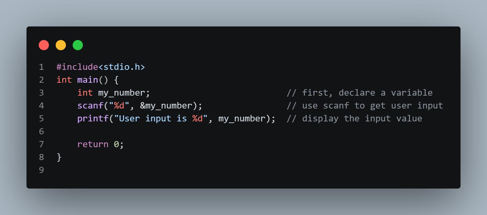
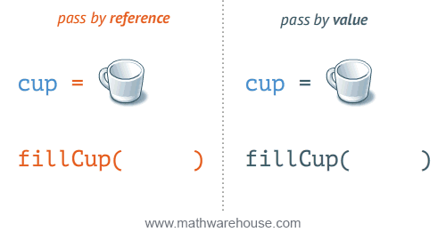
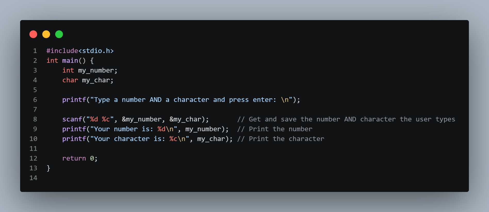

# User Input in C

**You have already learned that `printf()` is used to output values in C.**

**To get user input, you can use the `scanf()` function:**

This is the code snippet how to input integer into variable

## Why `scanf` need ampersand symbol??
From the mentioned code above, we will see the unsusal symbol when use `scanf`, it is an ampersand symbol `&`.

First of all, we need to understand how programming languages send data (argument) into functions.

There are 2 parameter passing mechanisms that we should know:
  1. **Pass-by-Value**: The value of a variable is cloned and passed into a function
  2. **Pass-by-Reference**: The value of reference that pointing to a value in memory is passed into a function

Regarding the question mentioned earlier, the answer is that C functions use **"pass-by-value"** by default, meaning they only receive a copy of a variable's data.

If we pass the variable directly, it does store user input to its copy, not the real one. So we need to send the address instead (`&` means the address of variable)

## Multiple Input

The `scanf()` function also allow multiple inputs.

---

you can check example code below
 - [scanf_example](../code/03_01_user_input.c)
 - [pass-by-value_and_pass-by-reference_example](../code/03_02_param_pass_mech.c)
 - [scanf_multiple_inputs](../code/03_03_multiple_inputs.c)

[Go to quiz](../quiz/02_quiz.c)

[Back]
[Next](../../02_data_types/./documents/02_01_data_types.md)